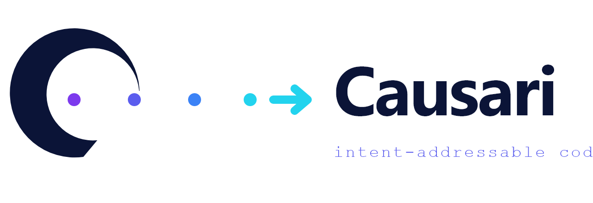

<p align="center">
  
</p>

<h3 align="center">Trace intent. Debug causality.</h3>
<p align="center"><em>Intent-addressable code for AI agents.</em></p>

<p align="center">
  <a href="https://causari.dev"><strong>causari.dev</strong></a>
  &nbsp;·&nbsp;
  <a href="https://github.com/croviatrust/causari/releases">Releases</a>
  &nbsp;·&nbsp;
  <a href="https://github.com/croviatrust/causari/discussions">Discussions</a>
  &nbsp;·&nbsp;
  <a href="#mcp-server">MCP</a>
  &nbsp;·&nbsp;
  <a href="LICENSE">License (BSL 1.1)</a>
</p>

<p align="center">
  
  
  
  
</p>

---

> *Causari* (Latin, deponent verb): *to plead a cause, to argue why.* Because
> every line of AI-generated code deserves to be defended, traced, and
> understood.

Causari records every action an AI agent takes on your codebase — not just
the bytes that changed, but the **prompt that asked**, the **model that
answered**, the **files it read**, and the **reasoning behind the change**.

And it does so **without asking the agent's permission**: the built-in
capture engine (`re proxy` + `re watch` + `re hook`) observes the LLM
traffic and the filesystem independently, then joins them by *content* —
the code that appears in your files is found inside the completion that
produced it seconds earlier. Provenance becomes a fact, not a self-report.

You can then ask questions no version control system has ever answered:

```bash
re proxy                      # local LLM proxy: every prompt, token and dollar
                              #   flows through Causari on its way to the provider
re watch                      # passive recorder + causal join: file changes get
                              #   attributed to the real prompt, model and cost
re hook  claude-code          # native capture via agent lifecycle hooks
re why    src/auth.ts:42      # who/what produced this exact line?
re trace  src/auth.ts:42      # full UPSTREAM causal cone: every event that
                              #   contributed transitively, through reads/writes
re impact <event-id>          # full DOWNSTREAM cone: what flowed from this action,
                              #   transitively (causality-aware blast radius)
re lens   src/auth.ts         # render a file with per-line provenance annotations
re find   "the JWT refactor"  # search every prompt, reasoning and message
re bisect --test "npm test"   # find the agent action that broke the build
re churn                      # measure AI code survival: how much survived vs
                              #   was rewritten, per agent, with wasted spend
re report --open              # generate a shareable HTML dashboard of AI waste
re skill  distill             # turn verified events into signed, reusable skills
re skill  verify              # Ed25519-check the whole skill library for tampering
re fork   experiment-claude   # branch into a parallel timeline
re revert <id>                # undo an action with causal preview of what else
                              #   you are implicitly undoing
```

When an agent touches 30 files and something breaks, you don't need to read
4 000 lines of chat. You ask Causari *why* and *when*.

## The Capture Engine — provenance without cooperation

Every provenance tool before Causari had the same fatal dependency: it only
worked if the agent volunteered its own history. Agents don't. Harnesses
don't expose reasoning. Nobody reports costs.

Causari removes the dependency. Two independent observation streams, one
causal join:

```
   ┌─────────────────────────┐        ┌─────────────────────────┐
   │        re proxy         │        │        re watch         │
   │                         │        │                         │
   │  sees every prompt,     │        │  sees every byte that   │
   │  completion, token and  │        │  changes on disk        │
   │  dollar (OpenAI- and    │        │  (snapshots, diffs)     │
   │  Anthropic-compatible)  │        │                         │
   └────────────┬────────────┘        └────────────┬────────────┘
                │                                  │
                │         CONTENT-BASED JOIN       │
                └────────────────►◄────────────────┘
                 the lines inserted in your files
                 are searched inside the completions
                 captured moments before — a match is
                 a causal fingerprint, with confidence
```

A real session, end to end:

```
$ re proxy
causari: LLM capture proxy listening on http://127.0.0.1:4242
  • gpt-4o  42→18 tok  $0.0003  "Add JWT refresh logic that rotates every 24h"

$ re watch          # in another terminal
  • 0d47599550  auth.py
    ↳ intent: "Add JWT refresh logic that rotates every 24h"  gpt-4o (confidence 100%, 3/3 lines)

$ re why auth.py:2
auth.py:2
      token = issue_token(user, scope="session")

introduced by 0d47599550
  agent:     cursor
  model:     gpt-4o
  prompt:    Add JWT refresh logic that rotates every 24h
```

Point any agent at the proxy and you're done:

```bash
OPENAI_BASE_URL=http://127.0.0.1:4242/openai/v1
ANTHROPIC_BASE_URL=http://127.0.0.1:4242/anthropic
```

Where the agent runtime exposes lifecycle hooks, capture is native and
exact — no inference needed:

```bash
re hook claude-code   # wires UserPromptSubmit + PostToolUse into
                      # .claude/settings.json: every prompt captured,
                      # every edit recorded as a full Causari event
```

Everything stays on your machine: `.causari/capture/` is a local,
append-only ledger. No cloud, no telemetry, no API keys touched.

## The Experience Layer — skills with earned trust

Recording the past is half the job. The other half is making sure no agent
ever pays for the same lesson twice.

`re skill distill` walks the ledger and compresses every completed task —
the prompt that triggered it, the steps that were taken, the files that
changed — into a **skill**: a unit of experience an agent can recall
*before* acting. Each skill is signed with the repository's **Ed25519 key**
at the moment of distillation; edit one byte afterwards and
`re skill verify` exposes it.

Trust is earned, never claimed:

```
●  recorded   distilled from the ledger — no success signal yet
◆  verified   evidence attached: exit code 0, or the work is still
              alive at the tip of the timeline (it survived)
★  proven     verified AND recalled 3+ times by agents doing new work
```

```
$ re skill distill
distill: 128 event(s) scanned, 7 new skill(s), 12 already distilled
  ◆ verified 2ce0c7bbda  add retry with exponential backoff

$ re skill verify
  ok 2ce0c7bbda  add retry with exponential backoff
verify: 7 skill(s), every signature valid
```

The loop closes through MCP: when an agent calls `causari_recall`, **signed
skills are returned first, ranked by trust** (proven ×4, verified ×2), and
every recall bumps the skill's use counter — which is exactly how a
verified skill earns the ★. Agents get measurably cheaper over time, and
`re churn` shows you the savings in dollars.

### Team skill mesh — no server, no accounts

One engineer's verified fix becomes every agent's instinct — without a
central SaaS:

```bash
re skill export 2ce0c7bbda --output jwt-fix.json   # portable bundle
re skill trust pubkey                             # share your Ed25519 key
re skill trust add platform <their-pubkey>        # trust a teammate/org key
re skill import jwt-fix.json                      # verify signature + accept
re skill pull ~/Dropbox/causari-skills/           # sync a whole team folder
```

Skills signed by unknown keys are **rejected**, not imported. The mesh is
cryptographic: Dropbox, git, NFS, S3 — any folder works. Causari verifies
Ed25519 on every file; tampered bundles fail closed.

Like everything in Causari, skills are local files (`.causari/skills/`),
self-contained and portable. The signature means a skill can be shared and
*verified by anyone* — the foundation for team-wide skill registries (see
roadmap).

## What makes it different

Existing tools either track text (git), track sessions (IDE checkpoints), or
track conversations (LangSmith, Helicone). **None of them connect a line of
code to the intent that produced it** — and none of them can do it without
the agent's cooperation. Causari does both:

| You ask… | Causari answers… |
|---|---|
| **`re proxy` + `re watch`** | **Zero-integration capture.** Prompts, models, tokens and dollars joined to file changes by content correlation — no agent cooperation required. |
| `re why src/auth.ts:42` | The prompt, model, agent, tool, and reasoning that wrote that line. |
| **`re trace src/auth.ts:42`** | **Upstream causal cone.** Every prior event that contributed, transitively, through the files it read or wrote. The intellectual ancestry of a piece of code. |
| **`re impact <event>`** | **Downstream causal cone.** Every later event that depended, transitively, on what this one produced. The blast radius of an action. |
| **`re lens src/auth.ts`** | The file rendered with **per-line provenance annotations**: each line painted with the event id that introduced it. |
| `re find "the JWT refactor"` | Signed **skills first**, then every event — prompt, message, reasoning — ranked by trust and relevance.
| `re bisect --test "<cmd>"` | The first agent action whose output fails your tests. |
| **`re churn`** | **AI Waste Score.** How much AI-written code survived vs was rewritten, per agent. With cost data: dollars spent on code that did not survive. |
| **`re report --open`** | A **self-contained HTML dashboard** you can paste into Slack, PRs, or board decks — zero external assets, zero cloud calls. |
| **`re skill distill`** | **Signed experience.** Verified past work compressed into Ed25519-signed skills, recalled by agents (trust-ranked) before they act — the same mistake is never paid twice. |
| `re fork claude-attempt` | A new timeline you can extend without touching the original. |
| **`re watch --session bot1`** | **Concurrent multi-agent recording.** One session per agent, lock-serialized commits, shared ancestry — no agent can orphan another's events. |
| `re sessions` / `re switch <name>` | The fleet overview: every session tip with agent and last activity; jump between timelines. |
| `re log --all` | The full event DAG across every session, with tip and fork-point markers. |
| `re diff a..b` | The exact file delta between two agent actions. |
| `re revert <id>` | Workspace snapped back to the pre-state of that action, **with a causal preview** of every downstream event you are implicitly undoing. |

### The bidirectional causal graph

Most version control is one-dimensional: a chain of commits. Causari is two-dimensional:

```
                 PAST                            FUTURE
   ┌──────────────────────────┐  ┌──────────────────────────┐
   │                          │  │                          │
   │   re trace foo.rs:42     │  │   re impact <event>      │
   │                          │  │                          │
   │   ← prompts & events     │  │   events & prompts →     │
   │   that produced this     │  │   that flowed from this  │
   │                          │  │                          │
   └──────────────┬───────────┘  └─────────────┬────────────┘
                  │                            │
                  │       a single event       │
                  └────────────►●◄─────────────┘
```

This unlocks a question nothing else can answer:

> *"If I revert this action, what else am I implicitly undoing?"*

`re revert` answers it before touching a single byte.

### Why `re trace` matters

Git blame names one author. `re why` names one event. **`re trace`** reconstructs
the *intellectual ancestry* of a piece of code:

```
calc.js:2
  export function sum(a, b) { return a - b; }

trace: 3 causal contributors found

● 0b8424ee83  align calc.js with updated spec
   agent: gpt-4o
   prompt: the spec was updated, make calc.js match
   because: wrote calc.js:2
  └─ 45230e9cda  update spec to redefine sum
     agent: gpt-4o
     prompt: the team decided sum should compute a-b, update the spec
     because: wrote spec.md which event 0b8424ee83 read
  └─ 55a6dd9392  implement calc per spec
     agent: claude-3.5
     prompt: implement sum() following the spec in spec.md
     because: wrote calc.js which event 0b8424ee83 read
```

The buggy line is not the root cause — the *prompt that asked the agent to
redefine the spec* is. Causari surfaces it. **You can debug prompts, not just
code.**

## How it works

Every event is a content-addressable object (BLAKE3) containing:

- `pre_snapshot` and `post_snapshot` — the workspace tree before and after
- `agent`, `model`, `tool`
- `prompt` — the user task that triggered the action
- `reasoning` — the agent's chain-of-thought when exposed
- `reads`, `writes`, `tokens_in`, `tokens_out`, `cost_usd`
- `parent` — the previous event in the timeline

Snapshots are incremental (only changed files create new blobs, just like
git's object store), so the storage cost is bounded by the *delta*, not the
absolute size of the workspace.

## Causari Log

```
[09:23:01]  re init
              → .causari/ repository initialized

[09:24:33]  re record -m "Add JWT refresh logic"
              → 12 lines in src/auth.ts
              → agent: claude-3.5-sonnet
              → prompt: "Add JWT refresh logic that rotates every 24h"

[09:25:12]  re guard
              ⚠ critical without test: src/auth.ts
              ⚠ 1 alert(s), 0 warning(s)

[09:25:45]  re why src/auth.ts:5
              → introduced by a3f7b2c9
              → prompt: "Add JWT refresh logic that rotates every 24h"
              → reasoning: The spec calls for refresh tokens...
              → 3 seconds

[09:26:18]  re trace src/auth.ts:5
              → a3f7b2c9 "Add JWT refresh"
                └─ e112706e "Update auth spec"
                  └─ c13aa663 "Initial scaffold"

[09:27:03]  re guard --badge
              ✓ .causari/guard-badge.svg generated

[09:27:44]  re impact a3f7b2c9
              → downstream: 2 events depend on this
              → c4d1e8f2 "Deploy to staging"
              → d5e2a1b3 "Fix OAuth scope"

[09:28:19]  re churn
              causari churn: code survival across 1,284 events
                AGENT          INTRO  SURVIVED  WASTE    WASTED $
                claude-3.5     8,210    6,012   26.8%    $164.10
                gpt-4o         3,400    1,510   55.6%    $116.90
                cursor         1,120      980   12.5%      $5.50

              AI survival 66.8% · AI Waste Score 33.2%
              $286.50 of $866.90 spent on code that did not survive

[09:29:02]  re report --open
              ✓ report written to causari-report.html
              → opening in browser

[09:29:33]  re revert a3f7b2c9
              ⚠ preview: 2 downstream events will lose context
              → confirm with --yes to proceed
```

Next on the roadmap:

- ~~**Verified skills (experience layer)**: events whose verification passed
  get promoted into signed, reusable skills the agent can recall *before*
  acting~~ ✓ shipped: `re skill distill/list/show/verify`, Ed25519
  signatures, trust ladder (● recorded → ◆ verified → ★ proven),
  trust-ranked `causari_recall` via MCP
- ~~**Multi-agent DAG timelines**: concurrent agents, true branching history~~
  ✓ shipped: `--session`, `re sessions`, `re switch`, `re log --all`
- ~~**Team skill registry**: share signed skills across an organization —
  one engineer's verified fix becomes every agent's instinct~~ ✓ shipped:
  `re skill export/import/pull`, `re skill trust` — Ed25519 mesh, no server
- Cryptographic timestamps (RFC 3161) + Ed25519-signed events for
  audit-grade timelines (EU AI Act, SOC2 for agentic development)
- **Agent Provenance Protocol**: an open spec for the signed,
  content-addressed event format, so any tool can produce or verify it
- TUI à la `lazygit` for visual exploration
- Cross-event semantic search over prompts and diffs (embeddings)
- Counterfactual `re replay --with <model>` (re-execute past events under different models)

## Plugging Causari into your agent (MCP)

Causari ships its own MCP server. Any agent runtime that speaks MCP
(Claude Desktop, Claude Code, Cursor, Cline, Windsurf, …) can register
Causari and get three new tools for free:

| Tool | What the agent uses it for |
|---|---|
| `causari_record` | Record one of its own actions into the ledger after each tool call. |
| `causari_recall` | Find past similar events *before* acting, to avoid repeating mistakes. |
| `causari_why`    | Inspect the provenance of a line before modifying code it didn't write. |

Get the JSON snippet to paste into your agent's config:

```bash
re mcp --install
```

Then in any conversation the agent can call those tools by name. Causari
silently builds a complete, queryable, causally-linked history of the session.

## CI / GitHub Action

Add the Causari Guard action to any repo and every pull request gets a
risk summary — zero cloud, zero configuration:

```yaml
# .github/workflows/guard.yml
name: Causari Guard
on:
  pull_request:

jobs:
  guard:
    runs-on: ubuntu-latest
    steps:
      - uses: actions/checkout@v4
      - uses: croviatrust/causari-guard-action@v1
```

It installs `re`, runs `re guard --summary`, and posts a Markdown table
of alerts directly into the PR thread. Block merges on risky patterns
(bulk edits, auth without tests, missing tests, etc.).

Keep the badge green on `main`:

```bash
re guard --badge   # .causari/guard-badge.svg
```

## Quickstart

### Install (one line)

Linux & macOS:

```bash
curl -sSf https://causari.dev/install.sh | sh
```

Windows (PowerShell):

```powershell
iwr -useb https://causari.dev/install.ps1 | iex
```

Installs a SHA256-verified, ~800 KB pre-built binary into `~/.local/bin`
(or `%LOCALAPPDATA%\Programs\causari` on Windows).

Prefer building from source?

```bash
cargo install --git https://github.com/croviatrust/causari
# or, with a local clone:
cargo build --release
./target/release/re --help
```

Scripted demos live in `scripts/`:

- **`demo-capture.ps1`** — the capture engine end to end: mock LLM upstream,
  `re proxy`, `re watch`, content-based causal join (`mock-llm.py` included)
- **`demo.sh`** / **`demo.ps1`** — full happy-path with `re why` and `re bisect`
- **`demo-trace.sh`** / **`demo-trace.ps1`** — upstream causal cone (`re trace`)
- **`demo-bidir.sh`** / **`demo-bidir.ps1`** — bidirectional causality
  (`re impact`, `re lens`, causality-aware `re revert`)
- **`demo-mcp.sh`** / **`demo-mcp.ps1`** — MCP server end-to-end via JSON-RPC

Causari runs natively on **Linux, macOS, and Windows** — the binary is a
single ~2 MB executable with no runtime dependencies.

## License

Causari is released under the **Business Source License 1.1** (see
`LICENSE`). In plain English:

- **Free for you, forever**, in all of these cases:
  - personal use, including paid client work;
  - any organization's own internal development, in production and CI/CD,
    at any scale;
  - use by AI agents acting on infrastructure you control (laptop, server,
    CI runner) — this is the default way Causari is meant to be used;
  - academic research, teaching, non-commercial open-source projects;
  - redistribution of unmodified binaries via cargo / brew / apt / choco /
    nix / winget.
- **Not free** if you want to resell Causari itself to third parties as a
  hosted or managed service whose primary value is version control,
  causality or provenance tracking for AI agents. For that, talk to us.
- **Becomes Apache 2.0 automatically** four years after each version is
  published. The change is mechanical: nothing the project maintainers can
  prevent or accelerate.

**The experience layer (skills) is and will remain free** in the `re`
binary — distillation, Ed25519 signing, verification and recall all run
locally and cost nothing. What will be commercial is the **Trust Plane**
built on top of it: organization-wide signed skill registries, RFC 3161
timestamping, fleet dashboards and audit-grade compliance exports. The
free tool creates the experience; the paid plane lets a company trust it
at scale.

Why BSL? Causari is meant to be widely used and modified, but we are not
interested in subsidizing a future closed-source clone built by a
better-distributed competitor. This is the same model that lets Sentry,
HashiCorp and CockroachDB stay genuinely useful and contributable while
sustaining the people who build them.

Contributing? See `CLA.md`.

---

Causari is built by [Croviatrust](https://croviatrust.com) — the team behind
**Crovia**, the cryptographically signed, Bitcoin-anchored public ledger of
AI training-data transparency. Same DNA, different layer: Crovia proves what
models learned; **Causari proves what agents did.**
